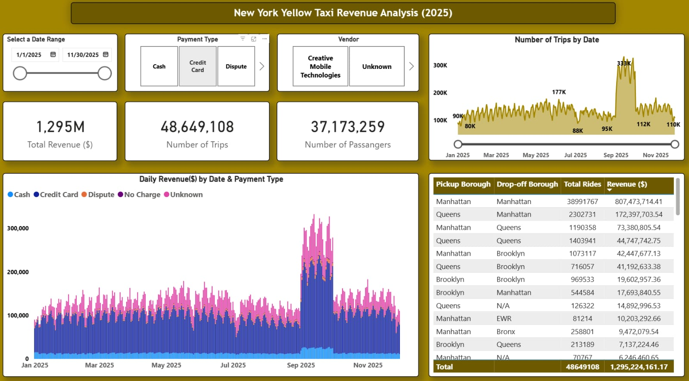

  

This repository has been created for the Microsoft Fabric NYC Yellow Taxi end to end data project.
Please refer to the [Wiki](https://github.com/malvik01/Fabric-NYC-Taxi-Data-Project/wiki) for the code used in the data pipelines, stored procedures, variables and parameters.

Dataset [Link](https://www.nyc.gov/site/tlc/about/tlc-trip-record-data.page)
Please refer to the above link to download latest year's Parquet files for Yellow Taxi.
